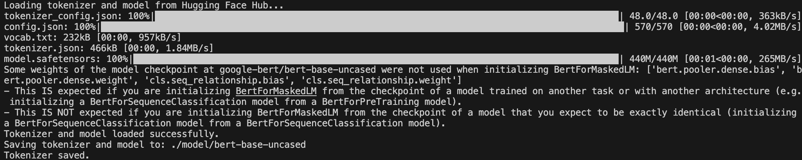
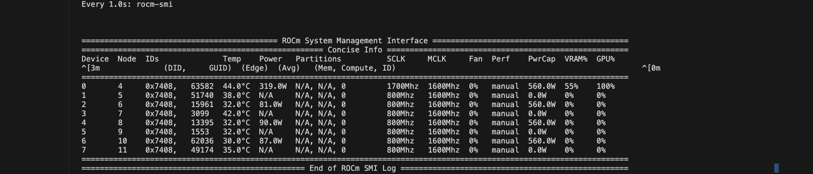
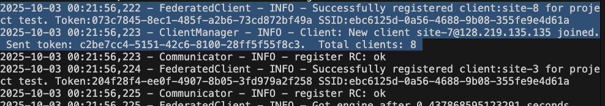

Step1: Create python-env or conda-env and doing setup
---
- Get this repo with git clone `git clone git@github.com:ductrong5x5/HPC_Flare.git`
    ```
    cd HPC_Flare/
    cd python_env/
    python -m venv env
    source env/bin/activate
    pip install seaborn pandas transformers seqeval tensorboard tensorflow
    cd ..
    pip install -e ./NVFlare/
    pip install -e ./PETINA/
    ```
- Depend on your system, you can install the Pytorch module of Rocm that you want. I installed the pytorch rocm 5.6
```
pip install torch==2.2.0 torchvision==0.17.0 torchaudio==2.2.0 --index-url https://download.pytorch.org/whl/rocm5.6
```
- You can access `/python_env/requirements.txt` to look at my env to compare.
- Inside this NVFlare already change the gpu_utils to what we are using. You can take a look at `NVFlare/nvflare/fuel/utils/gpu_utils.py`

Step2: download model and dataset
---
Since I have limitation in my home folder, so I choose the  hugging face folder in another place
```
export HF_HOME="./hf_home"
export HF_HUB_DISABLE_TELEMETRY=1
mkdir -p "$HF_HOME"
mkdir model
python download_model.py
```
- If you download the model, it will look like this

- Dataset can be found at `experiment_folder/data/nlp-ner`
- Each split will have dataset for each client. Each client will have a train and test dataset.

Step3: Edit the slurm file
---
- open file `slurm_debug_new.slurm`
- On line 27, change `LOCATION` to your current path
- `pwd`
- copy path and put to `LOCATION`

Step4: submit slurm job
---
- before submit slurm job, there are some variable that need to change based on the system
- in `slurm_debug_new.slurm`, feel free to change `#SBATCH --job-name=test_nvflare`
- my project is `csc666` so I need to put it there.
- `#SBATCH --qos=normal` (this is optional) -  it can be any based on your system.
- `#SBATCH --partition=batch` Frontier has `batch` partition, feel free to change to your system
- `#SBATCH --time=00:05:00` is for testing, your real run, I suggest 2 hour (02:00:00)
-`#SBATCH --output=logs/slurm_%j.out #SBATCH --error=logs/slurm_%j.err` these are used to see log of output and error.
- `#SBATCH --nodes=2` our experiments are 8, 16, 24, 32, 40, 48 clients. Since 8 clients per gpu, if we do 24 clients for example, we will do 3 node for clients, 8 clients per node, and 1 node for server, total of 4 node. In the default file, we have 2 node since the default job is for 8 clients, so 1 node for clients and 1 node for server.
- `#SBATCH --ntasks=9` is 8 tasks for clients and 1 task for server.
- `export LOG_LEVEL=INFO` is the output of logging for clients and server.
- `export JOB_NAME=bert_ncbi_gaussian_8` is the job you want to start
- `export MEM_EACH_GPU=60` memory of each gpu in Frontier is about 64GB, but I will put 60 (or less than or equal 64-63) here
-   Since some module is require to load on Frontier, I need to put them here. I don't know if LUMI will need these.
    ```
    module load PrgEnv-gnu/8.5.0
    module load miniforge3/23.11.0-0
    module load rocm/5.6.0 (this will based on pytorch we installed)
    module load craype-accel-amd-gfx90a
    ```
- My home directory is small so I need to download hugging face model/cache here
    ```
    export HF_HOME=$LOCATION/hf_home
    export HF_HUB_DISABLE_TELEMETRY=1
    ```
- Whenever server ready, it creates a flag then client srun start
    ```
    while [ ! -f "$SERVER_READY_FILE" ]; do
        sleep 10
    done
    ```
- `python start_admin.py` will start the NVFlare job
- start the job with `sbatch slurm_debug_new.slurm`
- If do correctly, there will we only 1 GPU run for 8 clients


Step5: Multiple node case - Internode
---
- Case 8 clients multiple node (default)
- Case 16 clients multiple node
    - Change `#SBATCH --nodes=3`
    - `#SBATCH --ntasks=17`
    - `export JOB_NAME=bert_ncbi_gaussian_16`
    - `srun --ntasks=$NUM_CLIENTS --nodes=2  --ntasks-per-gpu=8  --gpu-bind=closest setup.sh $NAME frontier client & `

- Case 24 clients multiple node
    - Change `#SBATCH --nodes=4`
    - `#SBATCH --ntasks=25`
    - `export JOB_NAME=bert_ncbi_gaussian_24`
    - `srun --ntasks=$NUM_CLIENTS --nodes=3  --ntasks-per-gpu=8  --gpu-bind=closest setup.sh $NAME frontier client & `
- Case 32 clients multiple node
    - Change `#SBATCH --nodes=4`
    - `#SBATCH --ntasks=33`
    - `export JOB_NAME=bert_ncbi_gaussian_32`
    - `srun --ntasks=$NUM_CLIENTS --nodes=4  --ntasks-per-gpu=8  --gpu-bind=closest setup.sh $NAME frontier client & `
- Case 40 clients multiple node
    - Change `#SBATCH --nodes=5`
    - `#SBATCH --ntasks=41`
    - `export JOB_NAME=bert_ncbi_gaussian_40`
    - `srun --ntasks=$NUM_CLIENTS --nodes=5  --ntasks-per-gpu=8  --gpu-bind=closest setup.sh $NAME frontier client & `
- Case 48 clients multiple node
    - Change `#SBATCH --nodes=6`
    - `#SBATCH --ntasks=49`
    - `export JOB_NAME=bert_ncbi_gaussian_48`
    - `srun --ntasks=$NUM_CLIENTS --nodes=6  --ntasks-per-gpu=8  --gpu-bind=closest setup.sh $NAME frontier client & `

Step6: Intranode - multiple clients in one node
- If SLurm allow multiple srun on 1 node, do like below: (example of 48 clients)
    - Change `#SBATCH --nodes=1`
    - `#SBATCH --ntasks=49`
    - `export JOB_NAME=bert_ncbi_gaussian_48`
    Change for client srun
    - `srun --ntasks=$NUM_CLIENTS --nodes=1  --ntasks-per-gpu=8  --gpu-bind=closest setup.sh $NAME frontier client & `

- If the above not work:
    - we have to manually do it on the system by doing `salloc` first.
    - Then activate the python env `source python_env/env/bin/activate`
    - set location variable `export LOCATION=$(pwd)`
    - set variable for job name ` export JOB="bert_ncbi_gaussian_8"`
    - setup HF `export HF_HOME=$LOCATION/hf_home`
    - `export HF_HUB_DISABLE_TELEMETRY=1`
    - Then run `./1_setup_intranode.sh` to update client data path
    - Then we start the server with `./example_intranode/localhost/startup/start.sh`
    - If HPC require load rocm module, make sure do it here. In my case, I do `module load rocm/5.6.0`
    - Then we can run `./2_run_client.sh` to run number of clients. Enter the number of clients based on the job. In this case, enter `8`
    - If we do it right, we will see
    
    - then we just need to start the job with `python 3_start_admin_intranode.py`
    - If you want to kill the Flare server and clients process, run`./kill.sh`


